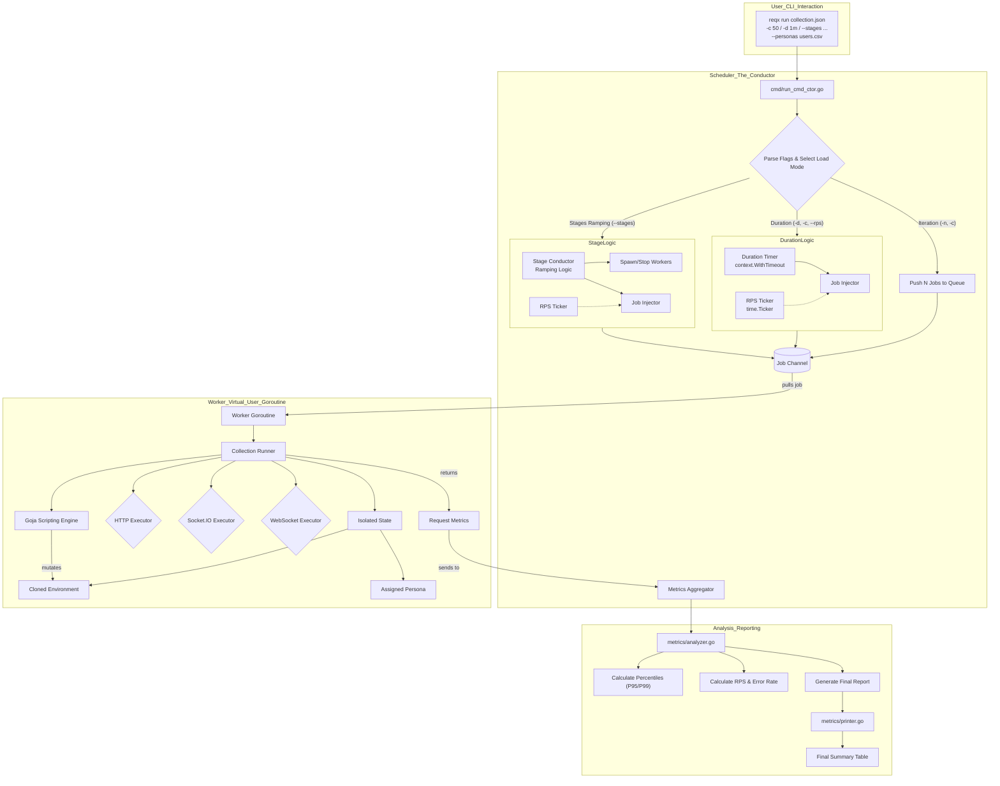

```mermaid
graph TD

subgraph User_CLI_Interaction
A["reqx run collection.json <br> -c 50 / -d 1m / --stages ... <br> --personas users.csv"]
end

subgraph Scheduler_The_Conductor
B["cmd/run_cmd_ctor.go"] --> ModeDecision{"Parse Flags & Select Load Mode"}

ModeDecision -- "Iteration (-n, -c)" --> IterationLogic["Push N Jobs to Queue"]
IterationLogic --> JobChannel[("Job Channel")]

ModeDecision -- "Duration (-d, -c, --rps)" --> DurationLogic

subgraph DurationLogic
direction LR
D_Timer["Duration Timer<br>context.WithTimeout"] --> D_Injector["Job Injector"]
D_RPSTicker["RPS Ticker<br>time.Ticker"] -.-> D_Injector
end

DurationLogic --> JobChannel

ModeDecision -- "Stages Ramping (--stages)" --> StageLogic

subgraph StageLogic
direction LR
S_Conductor["Stage Conductor<br>Ramping Logic"] --> S_Spawner["Spawn/Stop Workers"]
S_Conductor --> S_Injector["Job Injector"]
S_RPSTicker["RPS Ticker"] -.-> S_Injector
end

StageLogic --> JobChannel

MetricsAggregator["Metrics Aggregator"]

end

subgraph Worker_Virtual_User_Goroutine
JobChannel -- "pulls job" --> WorkerGoroutine["Worker Goroutine"]

WorkerGoroutine --> CollectionRunner["Collection Runner"]

CollectionRunner --> IsolatedState["Isolated State"]

IsolatedState --> ClonedEnv["Cloned Environment"]
IsolatedState --> AssignedPersona["Assigned Persona"]

CollectionRunner --> HTTP{"HTTP Executor"}
CollectionRunner --> SIO{"Socket.IO Executor"}
CollectionRunner --> WS{"WebSocket Executor"}

CollectionRunner --> Goja["Goja Scripting Engine"]

Goja -- mutates --> ClonedEnv

CollectionRunner -- returns --> Metrics["Request Metrics"]

Metrics -- sends to --> MetricsAggregator

end

subgraph Analysis_Reporting

F["metrics/analyzer.go"]

F --> R["Calculate Percentiles (P95/P99)"]
F --> S["Calculate RPS & Error Rate"]
F --> T["Generate Final Report"]

T --> U["metrics/printer.go"]

U --> V["Final Summary Table"]

end

A --> B
MetricsAggregator --> F
```