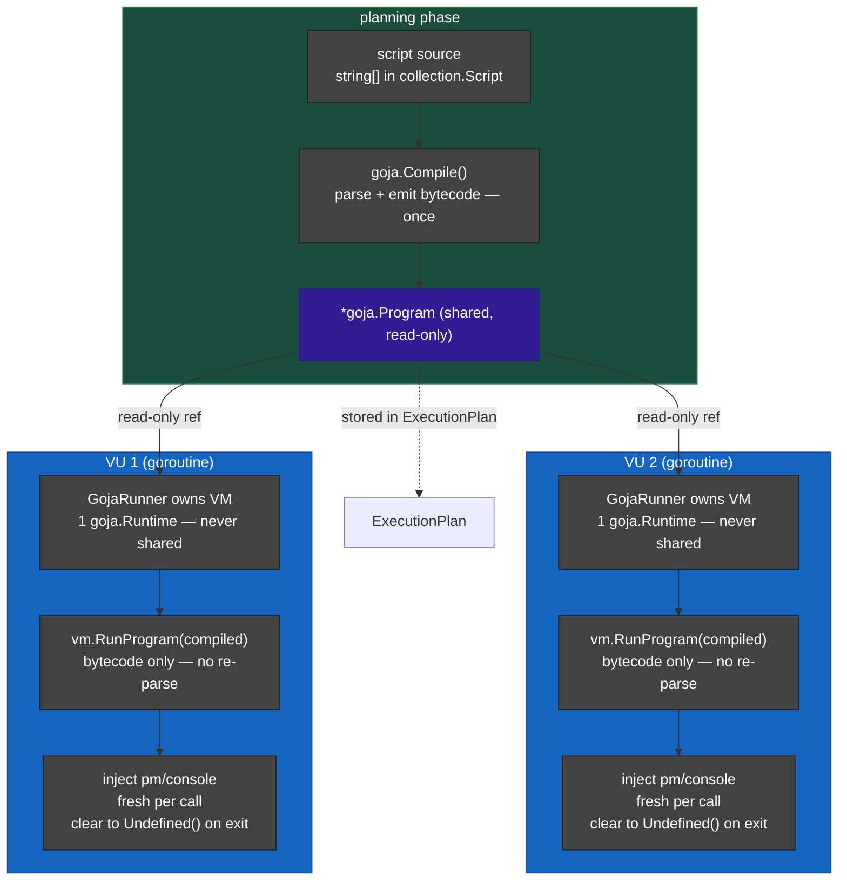

# Goja VM Architecture: Per-VU Ownership

This document explains the transition from a global `sync.Pool` to per-VU VM ownership and pre-compiled scripts.

### Key Improvements:
1.  **Pre-compilation:** JavaScript is parsed and compiled to bytecode **once** during the plan building phase. Requests only run the bytecode.
2.  **Strict Isolation:** Each Virtual User (Worker) has its own VM. A script in VU 1 physically cannot access variables from VU 2.
3.  **Zero Pool Overhead:** No more acquire/release logic or `sync.Pool` lock contention.
4.  **Performance:** `vm.RunProgram` is significantly faster than compiling a raw string on every request.
