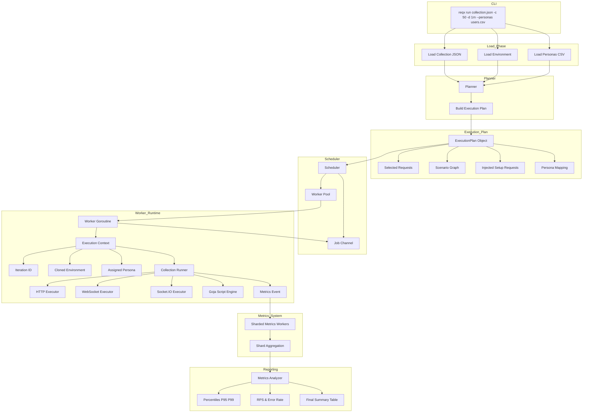

```mermaid
graph TD
subgraph CLI
A[reqx run collection.json -c 50 -d 1m --personas users.csv]
end
subgraph Load_Phase
B[Load Collection JSON]
C[Load Environment]
D[Load Personas CSV]
end
subgraph Planner
E[Planner]
F[Build Execution Plan]
end
subgraph Execution_Plan
G[ExecutionPlan Object]
G1[Selected Requests]
G2[Scenario Graph]
G3[Injected Setup Requests]
G4[Persona Mapping]
end
subgraph Scheduler
H[Scheduler]
I[Worker Pool]
J[Job Channel]
end
subgraph Worker_Runtime
K[Worker Goroutine]
L[Execution Context]
L1[Iteration ID]
L2[Cloned Environment]
L3[Assigned Persona]
M[Collection Runner]
N1[HTTP Executor]
N2[WebSocket Executor]
N3[Socket.IO Executor]
O[Goja Script Engine]
P[Metrics Event]
end
subgraph Metrics_System
Q[Sharded Metrics Workers]
R[Shard Aggregation]
end
subgraph Reporting
S[Metrics Analyzer]
T[Percentiles P95 P99]
U[RPS & Error Rate]
V[Final Summary Table]
end
A --> B
A --> C
A --> D
B --> E
C --> E
D --> E
E --> F
F --> G
G --> G1
G --> G2
G --> G3
G --> G4
G --> H
H --> I
H --> J
I --> K
K --> J
K --> L
L --> L1
L --> L2
L --> L3
L --> M
M --> N1
M --> N2
M --> N3
M --> O
M --> P
P --> Q
Q --> R
R --> S
S --> T
S --> U
S --> V
```
