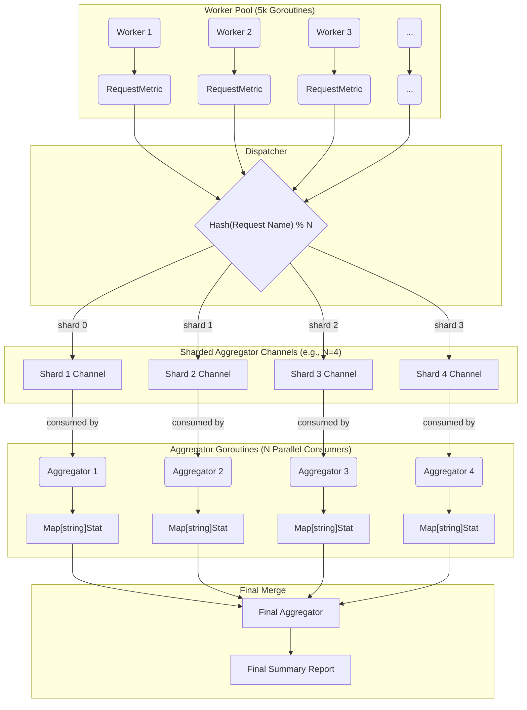

```mermaid
graph TD
    subgraph "Worker Pool (5k Goroutines)"
        W1("Worker 1") --> R1("RequestMetric")
        W2("Worker 2") --> R2("RequestMetric")
        W3("Worker 3") --> R3("RequestMetric")
        WN("...") --> RN("...")
    end

    subgraph "Dispatcher"
        D{"Hash(Request Name) % N"}
    end

    subgraph "Sharded Aggregator Channels (e.g., N=4)"
        C1[Shard 1 Channel]
        C2[Shard 2 Channel]
        C3[Shard 3 Channel]
        C4[Shard 4 Channel]
    end

    subgraph "Aggregator Goroutines (N Parallel Consumers)"
        A1("Aggregator 1") --> M1["Map[string]Stat"]
        A2("Aggregator 2") --> M2["Map[string]Stat"]
        A3("Aggregator 3") --> M3["Map[string]Stat"]
        A4("Aggregator 4") --> M4["Map[string]Stat"]
    end
    
    subgraph "Final Merge"
        F[Final Aggregator]
        F --> FS[Final Summary Report]
    end

    R1 --> D
    R2 --> D
    R3 --> D
    RN --> D

    D -- shard 0 --> C1
    D -- shard 1 --> C2
    D -- shard 2 --> C3
    D -- shard 3 --> C4

    C1 -- consumed by --> A1
    C2 -- consumed by --> A2
    C3 -- consumed by --> A3
    C4 -- consumed by --> A4

    M1 --> F
    M2 --> F
    M3 --> F
    M4 --> F
```