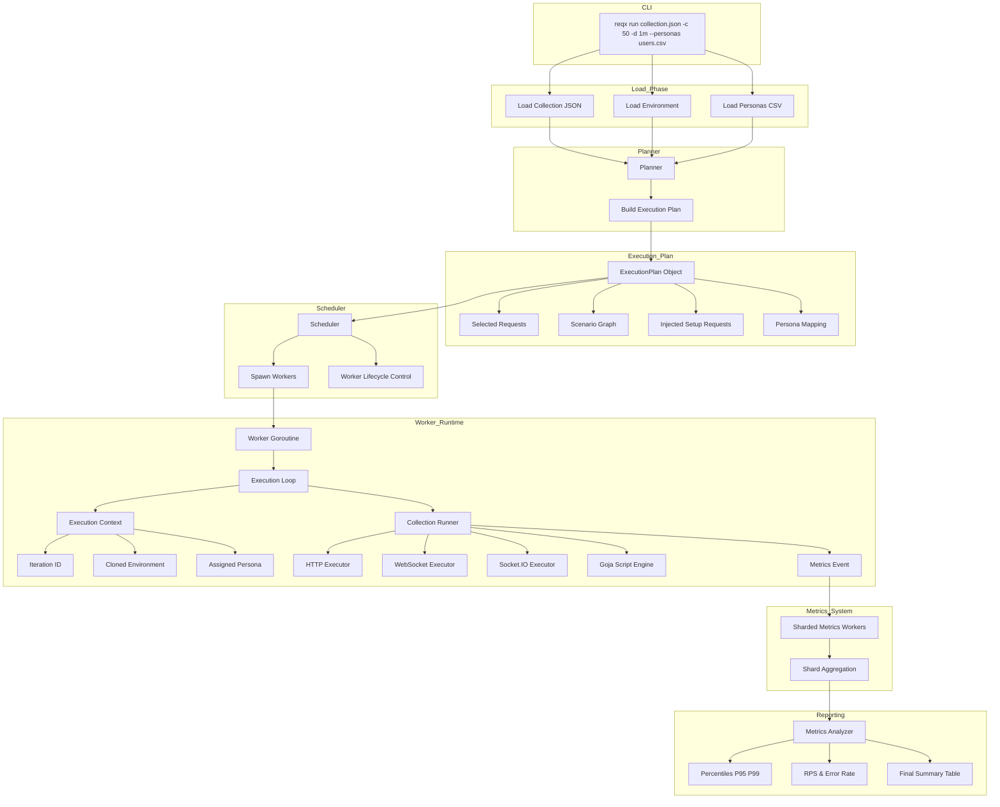

```mermaid
graph TD

subgraph CLI
A[reqx run collection.json -c 50 -d 1m --personas users.csv]
end


subgraph Load_Phase
B[Load Collection JSON]
C[Load Environment]
D[Load Personas CSV]
end


subgraph Planner
E[Planner]
F[Build Execution Plan]
end


subgraph Execution_Plan
G[ExecutionPlan Object]
G1[Selected Requests]
G2[Scenario Graph]
G3[Injected Setup Requests]
G4[Persona Mapping]
end


subgraph Scheduler
H[Scheduler]
I[Spawn Workers]
J[Worker Lifecycle Control]
end


subgraph Worker_Runtime
K[Worker Goroutine]

L[Execution Loop]

M[Execution Context]
M1[Iteration ID]
M2[Cloned Environment]
M3[Assigned Persona]

N[Collection Runner]

O1[HTTP Executor]
O2[WebSocket Executor]
O3[Socket.IO Executor]

P[Goja Script Engine]

Q[Metrics Event]
end


subgraph Metrics_System
R[Sharded Metrics Workers]
S[Shard Aggregation]
end


subgraph Reporting
T[Metrics Analyzer]
U[Percentiles P95 P99]
V[RPS & Error Rate]
W[Final Summary Table]
end


A --> B
A --> C
A --> D

B --> E
C --> E
D --> E

E --> F

F --> G
G --> G1
G --> G2
G --> G3
G --> G4

G --> H

H --> I
H --> J

I --> K

K --> L

L --> M

M --> M1
M --> M2
M --> M3

L --> N

N --> O1
N --> O2
N --> O3

N --> P

N --> Q

Q --> R
R --> S

S --> T

T --> U
T --> V
T --> W
```