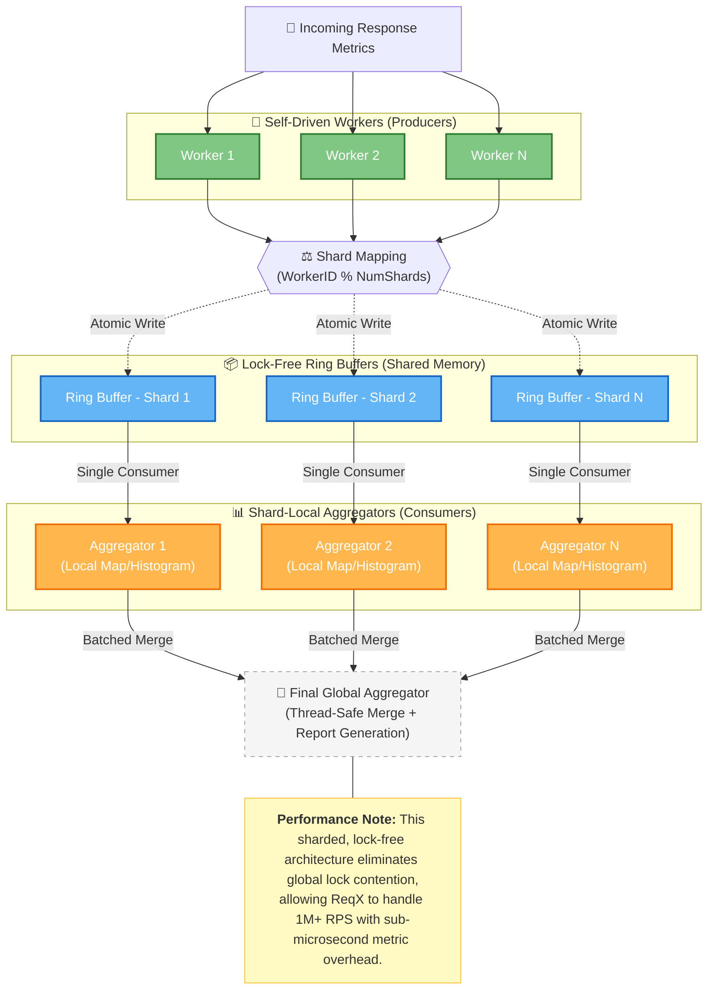

# 📈 ReqX Architecture: High-Performance Metrics Pipeline

To handle millions of requests per second without the metrics collection becoming a bottleneck, ReqX uses a **Sharded, Lock-Free Ring Buffer** architecture. 

## Architecture Diagram

## Why this approach?

1. **Lock-Free Producers**: Workers don't wait for a global mutex to record a metric. They write to a assigned shard buffer using atomic pointer increments.
2. **Cache-Efficiency**: Each aggregator (consumer) runs on its own core/goroutine, reducing CPU cache-line bouncing (False Sharing).
3. **Batched Processing**: Instead of updating the global state for every request, metrics are aggregated locally in shards and merged in bulk at the end of the test runtime.
4. **Predictable Memory**: Ring buffers have a fixed size, preventing memory spikes during extreme load bursts.
