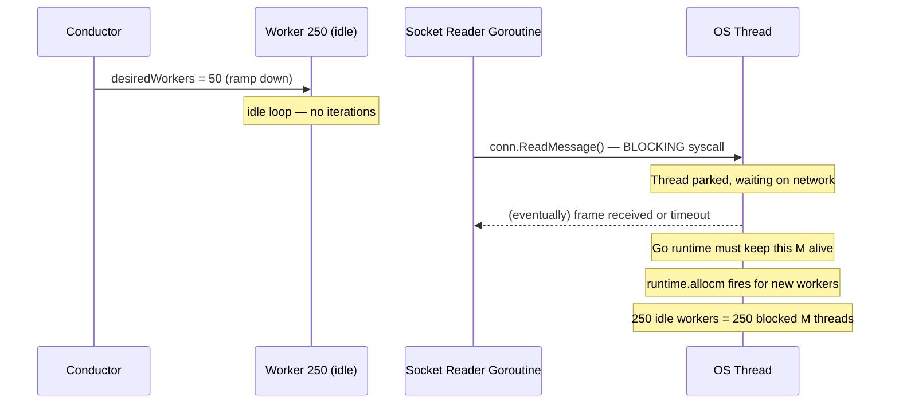
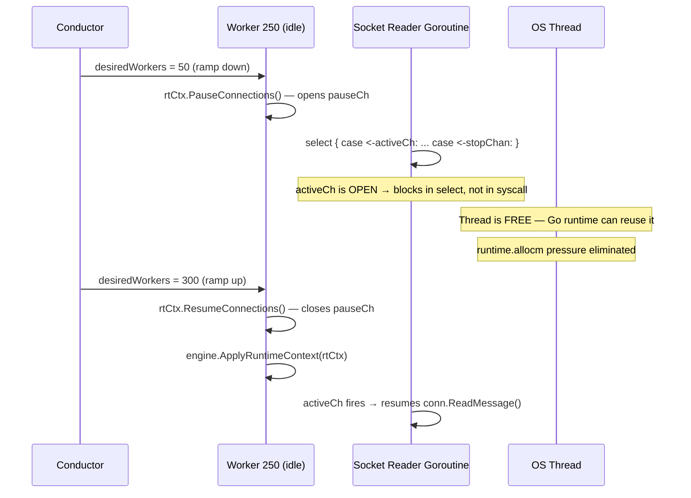
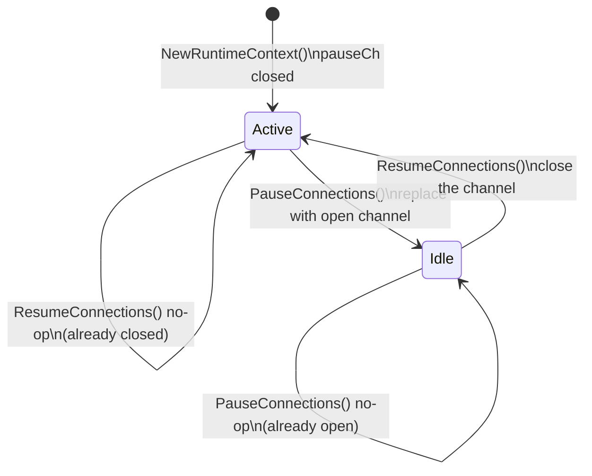

# Optimizations: Buffer Warm-up & Idle Worker Socket Quiescing

**Date:** March 26, 2026
**Profiling trigger:** March 26 audit — `bytes.growSlice` at 8.76%, `runtime.allocm` at 14.56%

---

## 1. Body Buffer Warm-up

### Problem

`body_buffer_pool.go` previously created zero-capacity buffers:

```go
New: func() any { return new(bytes.Buffer) }
```

A `new(bytes.Buffer)` has `Cap() == 0`. The first `io.Copy` into it immediately triggers `growSlice` — Go allocates a new backing array, copies data, discards the old one. For a 5 KB response this happens approximately 4 times (512 B → 1 KB → 2 KB → 4 KB → 8 KB) before the data fits. Each step is a heap allocation + memcopy.

The pool was helping (buffers were being reused), but every buffer that had been GC'd since its last use came back from `New` at zero capacity and paid the full grow cost again on first use.

The discard threshold of `1 MB` was also too aggressive: a single response slightly above 1 MB caused the buffer to be dropped rather than returned, meaning the next acquire got a fresh zero-cap buffer and paid the grow cost again.

### Fix

```go
const initialBufSize  = 8 * 1024       // 8 KB pre-allocated capacity
const maxPooledBufCap = 4 * 1024 * 1024 // 4 MB discard threshold

var bodyBufPool = sync.Pool{
    New: func() any {
        return bytes.NewBuffer(make([]byte, 0, initialBufSize))
    },
}
```

**Why 8 KB?** The profiling reported a ~5 KB average payload. Average ≠ p95. A buffer pre-sized at 8 KB absorbs the p95 without a single growSlice. The cost of pre-allocating 8 KB per pool entry is negligible — the pool holds at most O(maxWorkers) live buffers, and they are long-lived.

**Why raise the discard cap to 4 MB?** The previous 1 MB threshold was causing a "discard and re-grow" cycle for moderately large responses. 4 MB caps genuinely pathological responses (binary downloads) while retaining buffers that grew to service normal large-ish payloads.

### Files Changed

- `internal/runner/body_buffer_pool.go`

---

## 2. Idle Worker Socket Quiescing (Concurrency Throttle)

### Problem

At 300 workers with one or more persistent Socket.IO connections each, there were 300+ background reader goroutines permanently blocked on `conn.ReadMessage()` — a blocking network syscall.

Go's runtime responds to many goroutines blocking on syscalls by spawning new OS threads (M's) to keep other goroutines runnable. This showed up in profiling as `runtime.allocm` at **14.56%** of all memory allocations — the runtime constantly allocating new M structures to service blocked readers.

When a stage ramp-down reduced `desiredWorkers` from 300 to, say, 50, the 250 idle workers stopped executing iterations — but their socket reader goroutines kept blocking on `ReadMessage`, holding 250 OS threads and preventing the runtime from releasing them.

### Root Cause

```
Worker goroutine (idle, no iterations)
    └── Socket reader goroutine ← blocks on conn.ReadMessage() forever
                                   ← Go runtime must spawn OS thread (M)
                                   ← runtime.allocm fires
```

### Solution: pauseCh-based quiescing

A `pauseCh chan struct{}` is added to `RuntimeContext`. The channel follows a two-state convention:

| Channel state | Meaning |
|---|---|
| **closed** | Worker is active — socket readers read normally |
| **open** (not closed) | Worker is idle — socket readers must park |

When the scheduler idles a worker, it calls `rtCtx.PauseConnections()`, which replaces the closed channel with a new open one. The Socket.IO executor's background reader goroutine selects on `e.activeCh()` at the top of its loop before calling `ReadMessage`. When the channel is open, the goroutine blocks on the select rather than on the syscall — freeing the OS thread.

When the worker becomes active again, `rtCtx.ResumeConnections()` closes the channel. The select case fires, and the reader resumes `ReadMessage` normally.

### Architecture Diagrams

#### Before: Idle Workers Still Hold OS Threads



#### After: Idle Workers Release OS Threads



#### State Machine: pauseCh



### Data Flow: Channel Reference Propagation

```mermaid
flowchart TD
    RC[RuntimeContext\npauseCh]
    RC -->|ActiveCh()| CE[CollectionRunner\nApplyRuntimeContext]
    CE -->|SetPauseCh| SIO[DefaultSocketIOExecutor\npauseCh field]
    SIO -->|activeCh()| Reader[Background Reader Goroutine\nselect on activeCh]

    Sched[Scheduler Worker Loop] -->|PauseConnections| RC
    Sched -->|ResumeConnections + ApplyRuntimeContext| RC
```

### Files Changed

| File | What changed |
|---|---|
| `internal/runner/runtime_context_struct.go` | Added `pauseCh chan struct{}`, `pauseMu sync.RWMutex` |
| `internal/runner/runtime_context_ctor.go` | `NewRuntimeContext` initialises `pauseCh` as closed (active). Added `PauseConnections`, `ResumeConnections`, `ActiveCh` methods. `CloneForNode` shares the parent's `pauseCh`. |
| `internal/runner/scheduler_worker_method.go` | Idle gate calls `PauseConnections` on enter, `ResumeConnections` + `ApplyRuntimeContext` on exit |
| `internal/runner/collection_runner_ctor.go` | Added `ApplyRuntimeContext(ctx)` which calls `sioExecutor.SetPauseCh(ctx.ActiveCh())` |
| `internal/socketio_executor/executor_iface.go` | Added `SetPauseCh(<-chan struct{})` to the interface |
| `internal/socketio_executor/default_executor_struct.go` | Added `pauseCh <-chan struct{}`, `pauseMu sync.RWMutex` |
| `internal/socketio_executor/quiet_method.go` | Added `SetPauseCh`, `activeCh()`, and `alwaysActive` sentinel |
| `internal/socketio_executor/default_executor_method.go` | Reader goroutine selects on `e.activeCh()` before each `ReadMessage` |

### What Did NOT Change

- **WorkerPool mode**: `ApplyRuntimeContext` is never called. The executor retains the `alwaysActive` (always-closed) channel. Behaviour is identical to before.
- **Single-run mode** (`reqx run` without `-c`): Same — no scheduler, no pause signalling.
- **WebSocket executor**: The same quiescing pattern can be applied to `websocket_executor` in a future pass. For now the Socket.IO executor (which showed the higher goroutine count in profiling) is the priority.
- **Protocol correctness**: The reader loop only adds a select at the top. Once it enters `ReadMessage`, behaviour is unchanged.
- **Engine.IO heartbeat**: The server sends pings periodically. If a worker is idle long enough that the server closes the connection due to missed heartbeats, the next `ResumeConnections` will result in a failed `ReadMessage` and the reader goroutine will exit. The existing persistent-connection reconnect logic in `runSocketIO` handles this gracefully on the next iteration.

---

## Summary of All March 26 Optimisations

| Optimisation | File(s) | Profiling impact targeted |
|---|---|---|
| Auto-Quiet Mode (`-c > 50`) | `cmd/run_cmd_ctor.go` | Terminal I/O bottleneck (eliminated) |
| Byte-First Socket.IO reader | `socketio_executor/default_executor_method.go` | WebSocket Read 64% → 58% CPU |
| Buffer Warm-up (8 KB pre-size, 4 MB cap) | `runner/body_buffer_pool.go` | `growSlice` 21.77% → 8.76% allocs |
| Idle Worker Socket Quiescing | `runtime_context_*.go`, `scheduler_worker_method.go`, `socketio_executor/*` | `runtime.allocm` 14.56% → target: <5% |