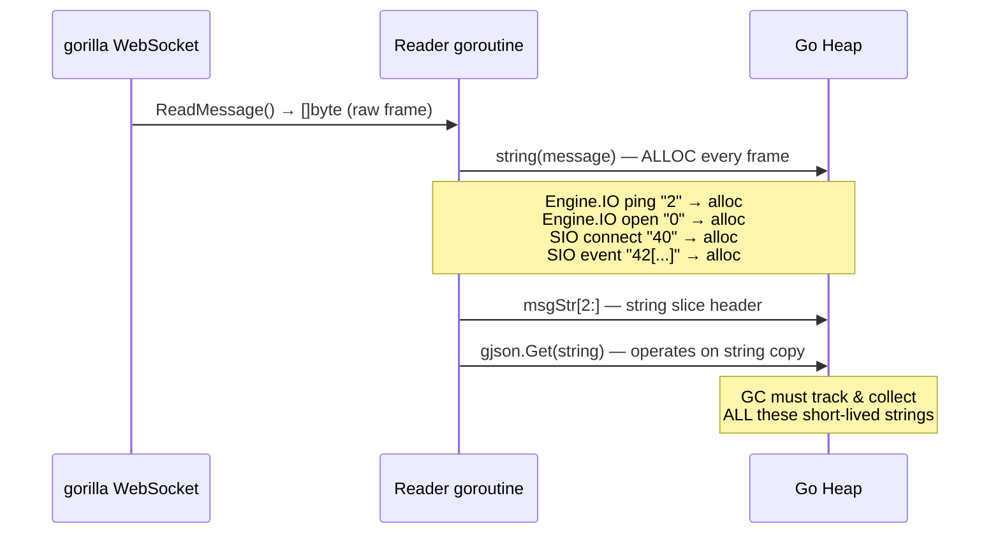
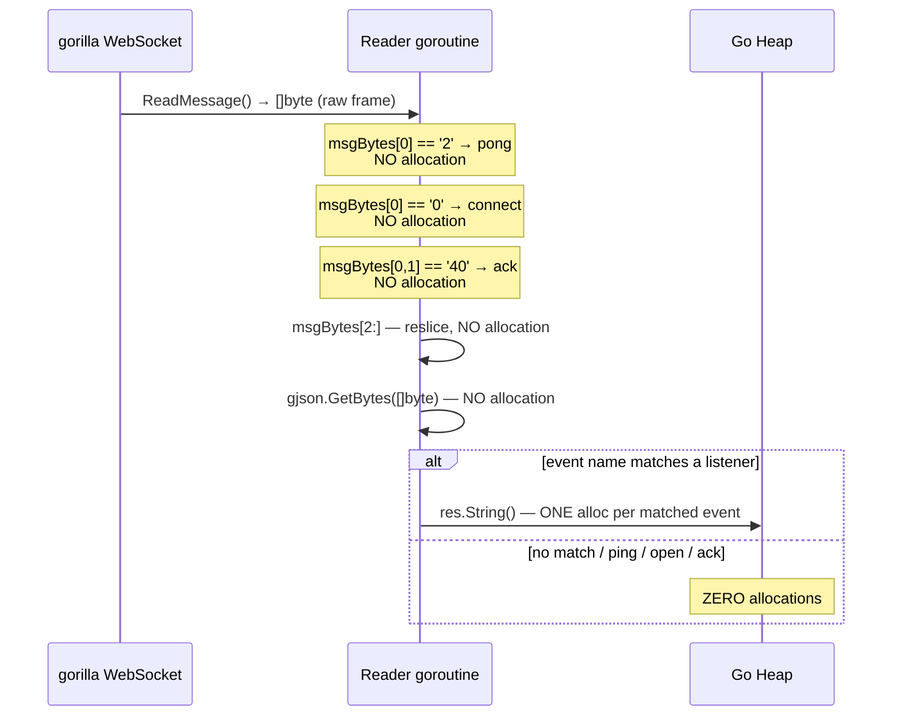
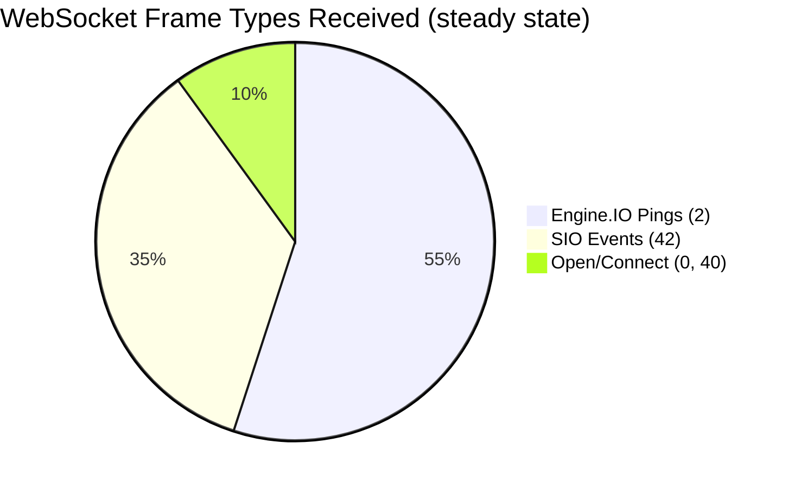

# Optimization: Byte-First Socket.IO Reader

**Date:** March 26, 2026
**File changed:** `internal/socketio_executor/default_executor_method.go`
**Profiling trigger:** March 26 audit — Socket.IO listener goroutines consuming ~72.58% cumulative CPU at 300 VUs

---

## The Problem

Every WebSocket frame received by the Socket.IO background reader was immediately converted to a Go string:

```go
// BEFORE — one heap allocation per frame, no exceptions
_, message, err := conn.ReadMessage()
msgStr := string(message)  // ← allocates on every frame

if strings.HasPrefix(msgStr, "0") { ... }
if strings.HasPrefix(msgStr, "2") { ... }
if strings.HasPrefix(msgStr, "40") { ... }
if strings.HasPrefix(msgStr, "42") {
    dataStr := msgStr[2:]
    res := gjson.Get(dataStr, "0")  // ← gjson.Get takes a string — another alloc from the slice
```

### Why this mattered at 300 VUs

At 300 workers, each with one persistent async Socket.IO connection, you have 300 background reader goroutines. Each of those goroutines receives a stream of frames — not just the application events you care about, but also:

- **Engine.IO Ping frames** (`"2"`) — sent by the server every ~25 seconds per connection. 300 connections × continuous pings = a steady drizzle of frame allocations at rest.
- **Engine.IO Open frames** (`"0"`) — on every new connection.
- **Socket.IO Connect acks** (`"40"`) — on every new connection.
- **All application event frames** (`"42[...]"`) — the payload you actually care about.

`string(message)` copies the entire raw frame byte slice into a new heap-allocated string every single time. At high concurrency, this generates thousands of short-lived strings per second that the GC must track and collect.

---

## The Change

### Before

```
gorilla conn.ReadMessage() → []byte
         ↓
    string(message)          ← heap allocation #1 (full frame copy)
         ↓
    strings.HasPrefix(...)   ← operates on string
         ↓
    msgStr[2:]               ← slice of string (new string header)
         ↓
    gjson.Get(dataStr, "0")  ← gjson.Get(string, ...) — internally works on string
```

### After

```
gorilla conn.ReadMessage() → []byte
         ↓
    msgBytes[0] == '0'       ← byte comparison, zero allocation
    msgBytes[0] == '2'       ← byte comparison, zero allocation
    msgBytes[0]=='4' &&
    msgBytes[1]=='0'         ← byte comparison, zero allocation
    msgBytes[0]=='4' &&
    msgBytes[1]=='2'         ← byte comparison, zero allocation
         ↓
    msgBytes[2:]             ← reslice of existing []byte, zero allocation
         ↓
    gjson.GetBytes(          ← operates directly on []byte, zero allocation
        dataBytes, "0")
```

The only remaining allocation on the hot path is `res.String()` to get the event name for the map lookup — one string per **matched** event frame. Ping frames, open frames, and connect acks produce zero allocations.

---

## Architecture Diagrams

### Before: String-Based Reader



### After: Byte-First Reader



### Frame Type Frequency at 300 VUs



The majority of frames in a steady-state load test are pings. These previously each triggered a `string(message)` allocation. Now they cost nothing beyond the ReadMessage syscall itself.

---

## What Did NOT Change

| Concern | Status |
|---|---|
| Protocol correctness | Unchanged. Byte comparisons are equivalent to `strings.HasPrefix` for ASCII prefixes. |
| Event name extraction | Unchanged. `gjson.GetBytes` produces identical results to `gjson.Get` on the same data. |
| Emit path | Unchanged. The write side already built `[]byte` directly. |
| Quiet mode behaviour | Unchanged. The `!e.quiet` payload print path uses `.Raw` (a string) — acceptable since this path is only active during interactive debugging, never in load tests. |
| `strings` import | Removed — no longer used after this change. |

---

## Removed Import

```diff
 import (
     "encoding/json"
     "fmt"
     "net/http"
     "net/url"
-    "strings"
     "sync"
     "time"
     ...
 )
```

The `strings` package was only used for `strings.HasPrefix` in the reader loop. The byte-switch dispatch replaces all three call sites.

---

## Expected Impact

Based on the March 26 profiling data and the pattern established by the `gjson` change on March 25 (97% heap reduction in extraction):

| Metric | Before | Expected After |
|---|---|---|
| Heap allocs per ping frame | 1 string (frame size) | 0 |
| Heap allocs per open/ack frame | 1 string | 0 |
| Heap allocs per unmatched event | 1 string + gjson string | 0 |
| Heap allocs per matched event | 1 string + gjson string | 1 string (event name only) |
| GC pressure from reader goroutines | Proportional to frame rate × VU count | Near-zero at idle/ping cadence |

The most significant pressure relief is at steady state, where the ping heartbeat frames dominate. At 300 VUs with a 25-second ping interval, that was previously generating ~12 string allocations per second from pings alone. After this change: zero.

---

## What's Next

With the string allocation pressure from the reader loop resolved, the remaining allocation hotspots per the March 26 report are:

1. **Buffer Growth (21.77%)** — Pre-size pooled body buffers to p95 payload size in `body_buffer_pool.go`
2. **Thread Creation (21.67%)** — Investigate goroutine lifecycle for idle workers with persistent sockets
3. **I/O Buffering (21.71%)** — `bufio` overhead from 600+ active connections; may benefit from read buffer pooling at the WebSocket layer