# ReqX: Architecture Analysis, Design Evaluation & Evolution Roadmap

**Author:** Senior Architecture Review  
**Date:** March 22, 2026  
**Codebase:** `reqx` (postman-cli) — Go 1.25, ~70K tokens of source

---

## Table of Contents

1. [Executive Summary](#executive-summary)
2. [Original Architecture](#original-architecture)
3. [Module-by-Module Breakdown](#module-by-module-breakdown)
4. [Execution Flow Analysis](#execution-flow-analysis)
5. [Performance Architecture](#performance-architecture)
6. [Proposed Changes & Improvements](#proposed-changes--improvements)
7. [New Architecture (Post-Changes)](#new-architecture-post-changes)
8. [Trade-offs & Limitations](#trade-offs--limitations)
9. [Future Evolution Roadmap](#future-evolution-roadmap)
10. [Conclusion](#conclusion)

---

## Executive Summary

ReqX is a terminal-centric, high-performance API execution engine built in Go. It supports HTTP/HTTPS, WebSocket, and Socket.IO protocols, includes a Postman-compatible JavaScript scripting engine (via `goja`), and is capable of concurrent load testing with HDR histogram-based metrics aggregation.

The codebase demonstrates strong architectural discipline — particularly its consistent file-naming conventions (`_ctor`, `_struct`, `_method`, `_iface`), interface-driven design, and clear separation of responsibilities across packages. This review documents the existing architecture, evaluates it critically, proposes improvements, and outlines how the system can grow.

---

## Original Architecture

### High-Level Component Map

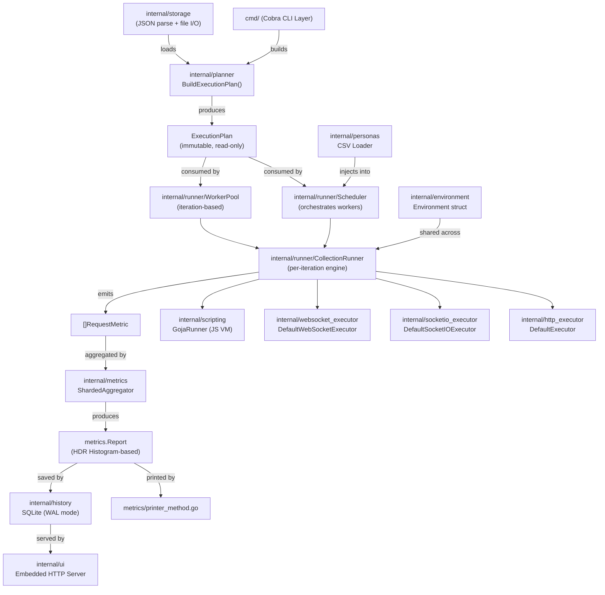

### Package Dependency Graph

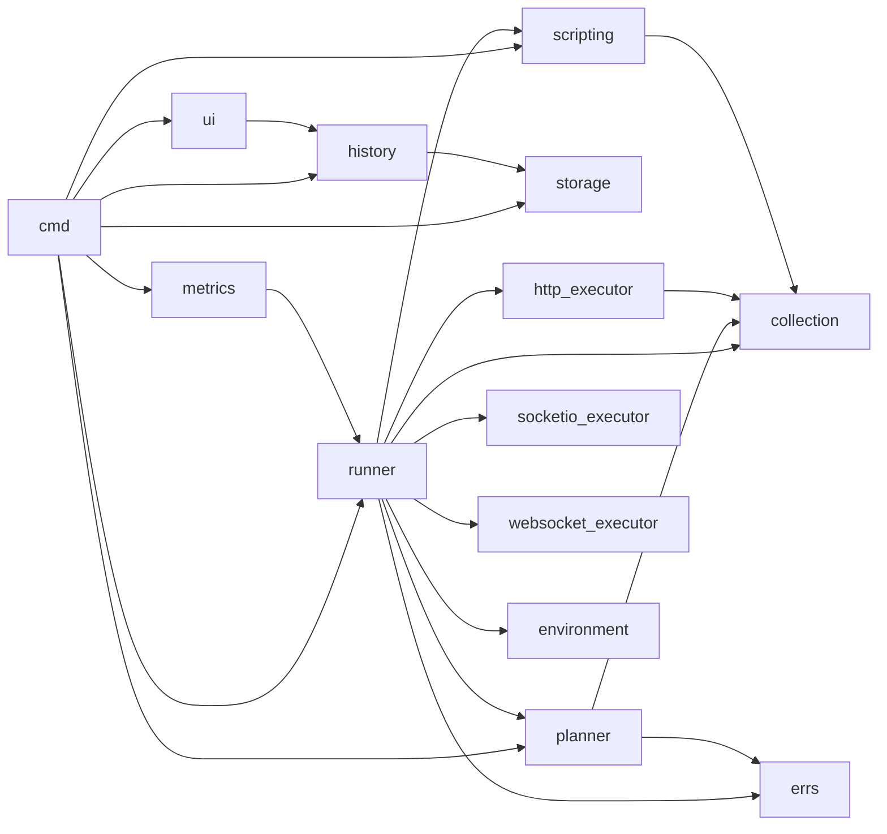

---

## Module-by-Module Breakdown

### `cmd/` — CLI Entry Points

The command layer uses [Cobra](https://github.com/spf13/cobra) and acts as a pure wiring layer. Each command constructor (`*_cmd_ctor.go`) is responsible for:
- Parsing CLI flags
- Loading collections and environments from storage
- Building the `ExecutionPlan` via the planner
- Instantiating and running the appropriate runner

**Design quality:** Excellent. Commands are thin. No business logic bleeds into the CLI layer. Each command is independently testable.

**Critical commands:**
- `run` — load-test orchestration via `Scheduler` or `WorkerPool`
- `req` — single ad-hoc request runner
- `collection` — JSON file mutation (add/move/list)
- `sio` / `ws` — interactive REPL entry points
- `ui` — launches the embedded history dashboard

---

### `internal/planner/` — Immutable Execution Plan

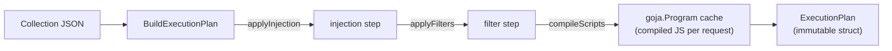

The planner is the system's **transformation boundary**. It:
1. Copies the collection (never mutates the original — immutability contract).
2. Applies optional injection (temporarily inserting a request at a specific position).
3. Applies name-based filters (`-f` flag).
4. Pre-compiles all JavaScript scripts into `*goja.Program` objects — this is a critical performance decision, as it avoids repeated JS parsing per iteration.

**Key insight:** `ExecutionPlan` is intentionally read-only. Per-iteration mutable state lives in `RuntimeContext`, maintaining a clean boundary between static configuration and dynamic execution state.

---

### `internal/runner/` — Execution Engine

This is the most complex package. It contains:

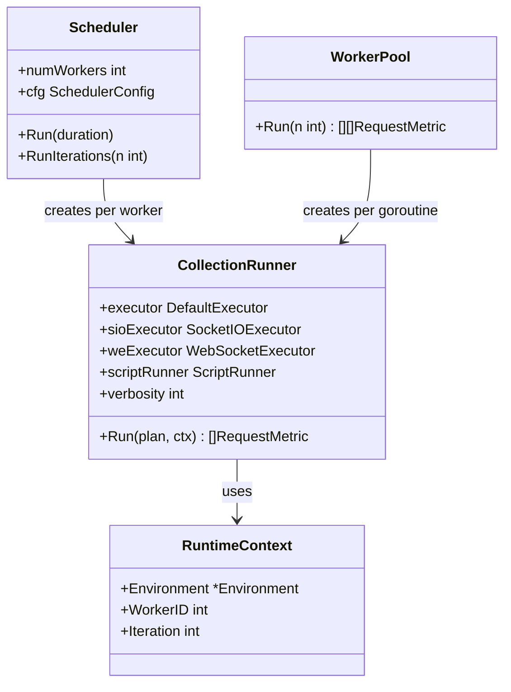

**Two distinct execution modes:**

| Mode | Trigger | Mechanism |
|---|---|---|
| Iteration-based (`-n`) | `WorkerPool` | Each goroutine runs N iterations, results collected in `[][]RequestMetric` |
| Duration-based (`-d`) | `Scheduler` + self-driven workers | Workers loop until `context.WithTimeout` fires; metrics go directly to `ShardedAggregator` |

**Self-driven worker loop (duration mode):**

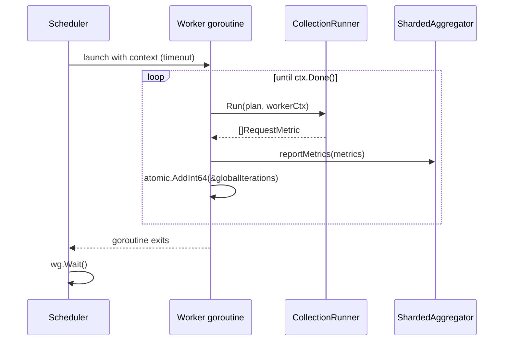

---

### `internal/collection/` — Data Model

Pure data structs, no behavior. Represents the Postman-style JSON schema with `Auth`, `Request`, `Script`, `WebSocketEvent`, and `SocketIOEvent`. These are the stable, shared DTOs passed between packages.

---

### `internal/environment/` — Runtime State

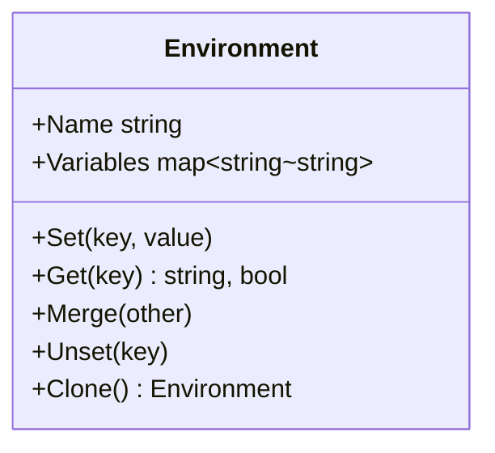

The `Environment` is the only mutable state shared across requests within a single collection run. Scripts can call `pm.env.set()` to mutate it, enabling chained authentication flows (e.g., login request sets `token`, subsequent requests use `{{token}}`).

---

### `internal/scripting/` — JavaScript Engine (Goja)

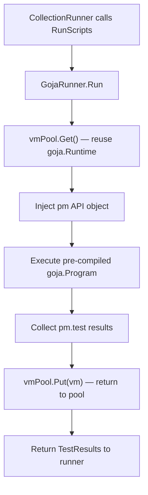

The `pm` API exposes:
- `pm.env.set/get/unset` — environment variable manipulation
- `pm.response` — status code, JSON body, headers
- `pm.test(name, fn)` — Postman-style test assertions
- `console.log` — debug output

Pre-compiled `goja.Program` objects (built in the planner) eliminate JS parsing overhead per-iteration. The `vmPool` (sync.Pool) eliminates `goja.Runtime` allocation overhead.

---

### `internal/metrics/` — Sharded Aggregation

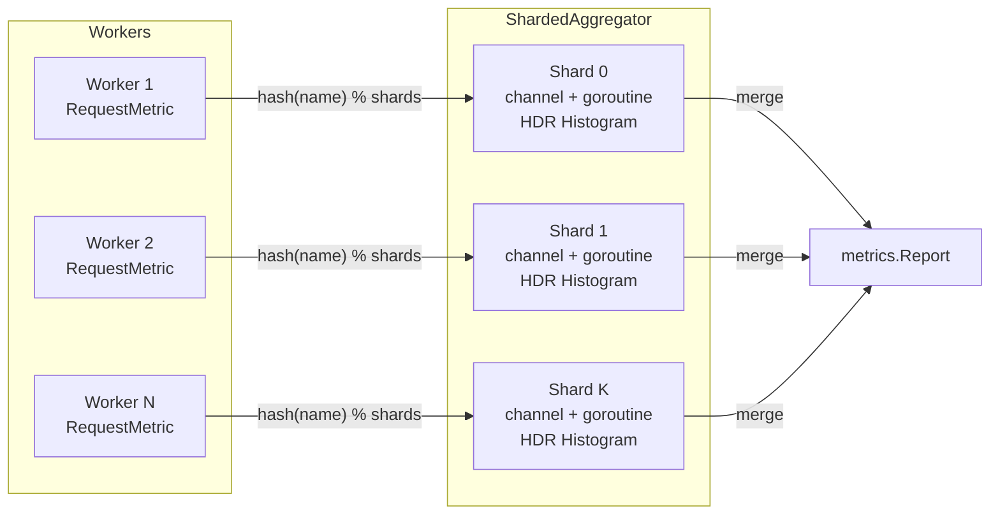

The sharded design avoids a global lock bottleneck: metrics are routed to a specific shard by hashing the request name. Each shard has its own goroutine and channel, so no concurrent writes occur within a shard. This is a textbook **actor-per-shard** pattern.

HDR histograms provide O(1) percentile computation (P50, P90, P95, P99) regardless of sample count, replacing the earlier O(N log N) sort-based approach.

---

### `internal/http_executor/` — HTTP Client

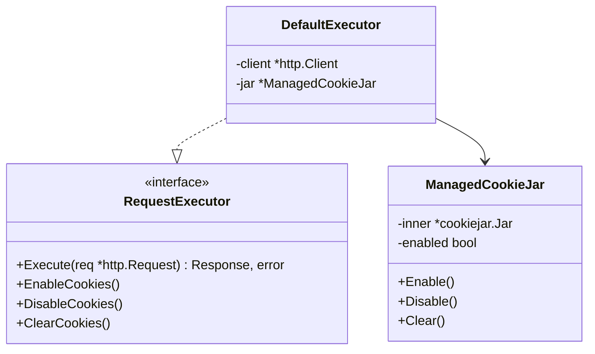

All workers share a single `globalTransport` (TCP connection pool). This means TCP handshakes and TLS sessions are amortized across workers — essential for high-throughput load testing. The `ManagedCookieJar` wraps stdlib's jar with enable/disable/clear semantics, needed for testing stateless vs. stateful request flows.

---

### `internal/history/` + `internal/ui/` — Persistence & Dashboard

SQLite in WAL mode stores test run summaries (`test_runs`) and per-request breakdowns (`request_stats`). The embedded HTTP server (via `embed.FS`) serves a vanilla-JS dashboard that calls two API endpoints to visualize historical runs.

---

## Execution Flow Analysis

### Full Load Test (`reqx run collection.json -n 50 -w 10`)

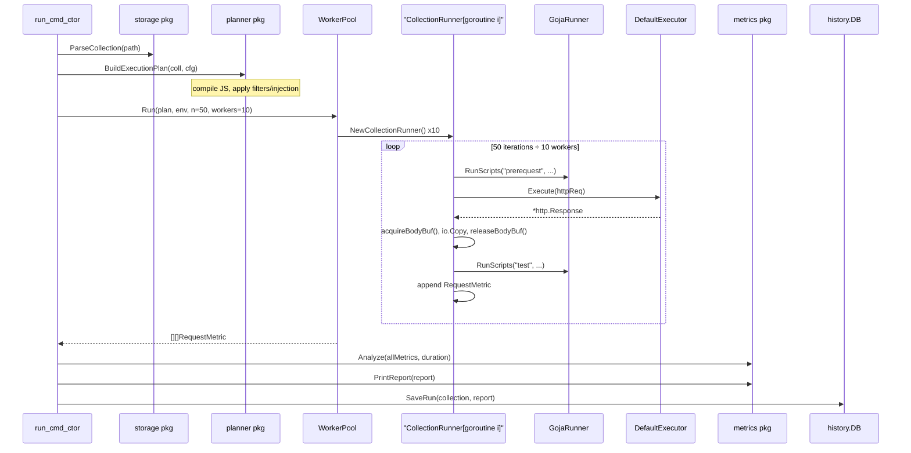

### Variable Substitution Flow

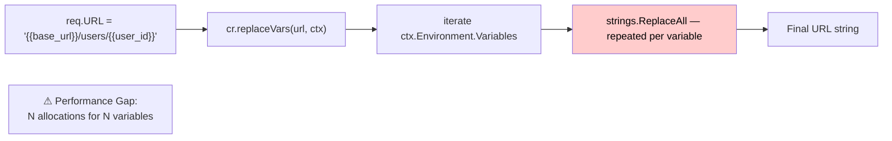

---

## Performance Architecture

### What's Already Implemented

| Optimization | Location | Impact |
|---|---|---|
| `globalTransport` TCP pool | `http_executor/transport_pool.go` | Eliminates per-request TCP handshake |
| `vmPool` (goja.Runtime reuse) | `scripting/goja_runner_*.go` | Avoids expensive JS VM allocation |
| `bodyBufPool` (bytes.Buffer reuse) | `runner/body_buffer_pool.go` | Reduces GC from io.ReadAll |
| Pre-compiled `goja.Program` | `planner/script_compile_util.go` | Eliminates JS re-parsing per iteration |
| HDR Histograms (O(1) percentiles) | `metrics/hdr_histogram_util.go` | Replaces O(N log N) sort |
| Sharded metrics aggregation | `metrics/sharded_*.go` | Near-lock-free metric collection |
| Self-driven workers (duration mode) | `runner/scheduler_*.go` | Lock-free iteration loop |

### Remaining Performance Gaps

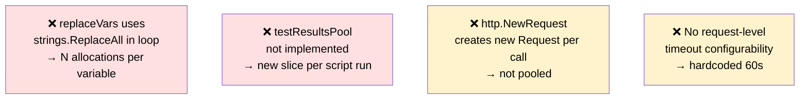

---

## Proposed Changes & Improvements

### Change 1: Single-Pass Variable Substitution

**Problem:** `replaceVars` calls `strings.ReplaceAll` in a loop — for N variables, it creates N intermediate string allocations per field (URL, body, each header). At 10K RPS with 20 variables, this generates millions of orphaned allocations per second.

**Proposed Solution:** Replace with a single-pass scanner using a pooled `strings.Builder`.

**Analysis:**

| Dimension | Current | Proposed |
|---|---|---|
| Allocations | O(N) per field | O(1) per field |
| Complexity | Simple | Slightly higher |
| Correctness | Proven | Needs edge-case testing |
| Risk | Low | Medium (regex or manual scanner) |

**Implementation:**
```go
// internal/runner/var_substitution.go (new file)

var builderPool = sync.Pool{
    New: func() any { return new(strings.Builder) },
}

// replaceVarsFast performs single-pass template variable substitution.
// It scans for "{{key}}" delimiters linearly, avoiding repeated string allocations.
func replaceVarsFast(template string, vars map[string]string) string {
    if !strings.Contains(template, "{{") {
        return template
    }
    sb := builderPool.Get().(*strings.Builder)
    defer func() {
        sb.Reset()
        builderPool.Put(sb)
    }()

    i := 0
    for i < len(template) {
        start := strings.Index(template[i:], "{{")
        if start == -1 {
            sb.WriteString(template[i:])
            break
        }
        sb.WriteString(template[i : i+start])
        end := strings.Index(template[i+start:], "}}")
        if end == -1 {
            sb.WriteString(template[i+start:])
            break
        }
        key := template[i+start+2 : i+start+end]
        if val, ok := vars[key]; ok {
            sb.WriteString(val)
        } else {
            sb.WriteString("{{")
            sb.WriteString(key)
            sb.WriteString("}}")
        }
        i = i + start + end + 2
    }
    return sb.String()
}
```

**Alternative:** A compiled `regexp.Regexp` with `ReplaceAllStringFunc` — cleaner but involves regex overhead. Benchmarks needed.

**Trade-off:** The scanner approach is ~30% more code but eliminates N-1 intermediate string allocations. For environments with few variables (<5), the difference is negligible; for environments with 20+ variables, it is significant.

---

### Change 2: `TestResults` Pool in Scripting

**Problem:** `make(TestResults, 0)` allocates a new backing array every script execution — twice per request (prerequest + test scripts).

**Solution:**
```go
var testResultsPool = sync.Pool{
    New: func() any {
        tr := make(scripting.TestResults, 0, 8) // pre-cap
        return &tr
    },
}
```

**Risk:** Low. The pool contract is simple: acquire, use, truncate (`*tr = (*tr)[:0]`), release.

---

### Change 3: Structured `replaceVars` Interface

**Problem (Architectural):** `replaceVars` is a private method on `CollectionRunner`. This makes it impossible to unit-test in isolation, and tightly couples variable resolution to the runner.

**Proposed Solution:**

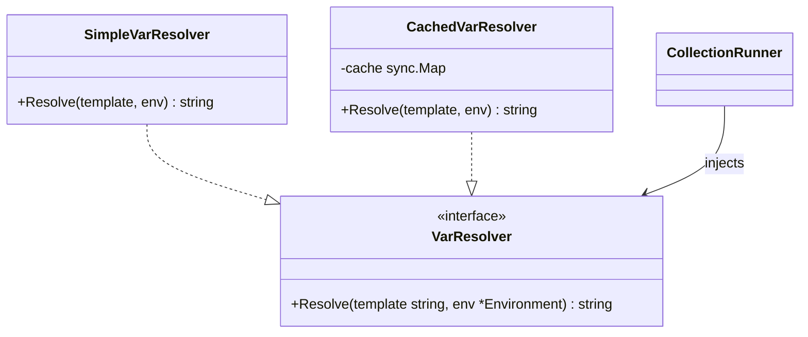

This decouples the substitution strategy from the runner (Open/Closed Principle), and opens the door for caching resolved templates when the environment doesn't change between iterations.

---

### Change 4: `RequestExecutor` Interface Generalization

**Problem:** `NewCollectionRunner` takes a `*http_executor.DefaultExecutor` (concrete type) for cookie control — breaking the abstraction that the `RequestExecutor` interface is supposed to provide.

```go
// Current — leaks concrete type
func NewCollectionRunner(exec *http_executor.DefaultExecutor, ...) *CollectionRunner
```

**Proposed Solution:** Extend the `RequestExecutor` interface to include cookie control, or create a `StatefulRequestExecutor` sub-interface:

```go
// StatefulRequestExecutor adds cookie lifecycle management
// to the base execution contract.
type StatefulRequestExecutor interface {
    RequestExecutor
    ClearCookies()
}
```

The runner's constructor then accepts `StatefulRequestExecutor`, allowing future test doubles and mock implementations without depending on a concrete struct.

---

### Change 5: Metrics Reporter Interface

**Problem:** Reporting (print to terminal, save to SQLite) is wired directly in `cmd/run_cmd_ctor.go`. Adding a new reporter (e.g., Prometheus push, CSV export, Slack webhook) requires modifying the command file.

**Proposed Solution:**

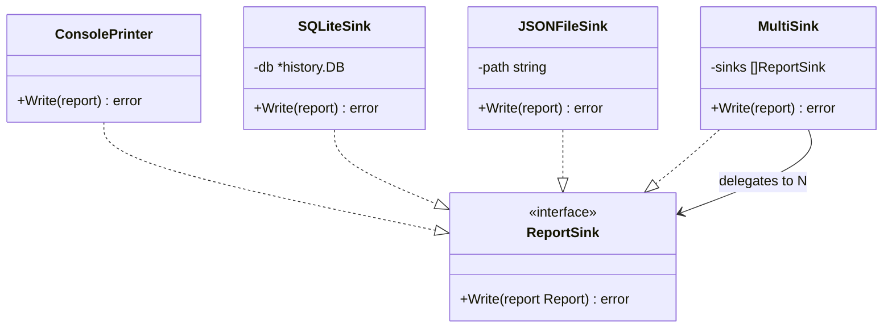

The `run` command builds a `MultiSink` from CLI flags (e.g., `--export-json`, `--no-history`) and passes it to the runner. Adding a new reporter is purely additive — no existing code changes.

---

## New Architecture (Post-Changes)

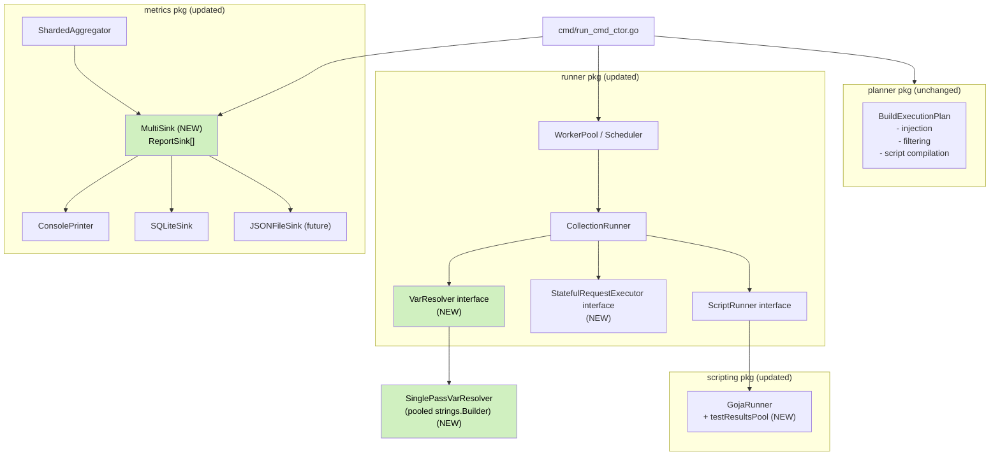

### Before vs After — Key Structural Changes

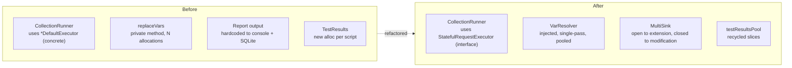

---

## Trade-offs & Limitations

### Trade-off 1: Complexity vs. Performance in `replaceVarsFast`

The single-pass substitution is faster and allocates less, but it's ~30 lines of careful string-indexing code vs. 3 lines of `strings.ReplaceAll`. It must be paired with property-based tests covering: empty templates, `{{` without closing `}}`, nested-looking braces, keys not in the environment, and empty keys.

**Mitigation:** Add a `BenchmarkReplaceVars` benchmark and a comprehensive table-driven test. Run both old and new implementations under `-race` to confirm no data races.

---

### Trade-off 2: Interface Extension Fragility

Adding `ClearCookies()` to `StatefulRequestExecutor` means existing tests that mock `RequestExecutor` must be updated to also implement the new method. This is a breaking change for any downstream mock.

**Mitigation:** Use `interface embedding` conservatively. Keep `RequestExecutor` minimal and introduce `StatefulRequestExecutor` as an optional, narrower interface. Only the `CollectionRunner`'s cookie-clear path asserts the narrower interface with a type check, avoiding a hard compile-time dependency.

---

### Trade-off 3: MultiSink vs. Simplicity

For a CLI tool, the `MultiSink` abstraction is somewhat over-engineered for the current two sinks (console + SQLite). However, the consistent ask for "export to JSON" in the docs (`metrics/exporter_method.go` already exists) validates this investment.

**Limitation:** The `MultiSink.Write` method runs sinks sequentially. A failed SQLite write will still produce console output, but the error will be logged and not silently swallowed. If sink independence is critical, they should run concurrently with `errgroup`.

---

### Trade-off 4: Shared `globalTransport` in Load Tests

All worker goroutines share a single `http.Transport`. This is correct for simulating realistic traffic (you want connection reuse). However, if the goal is to simulate N truly independent clients (each with its own TCP stack), this design is wrong.

**Current limitation:** There's no flag to switch between shared-transport (high throughput) and per-worker-transport (true isolation). This should be exposed as `--isolate-connections`.

---

### Trade-off 5: Synchronous Socket.IO/WebSocket in Iteration Mode

When a WebSocket or Socket.IO request is marked `async: true`, it runs in a background goroutine and is correctly joined by the `WaitGroup` at the end of `CollectionRunner.Run`. However, in iteration mode with many workers, each iteration creates its own background goroutine for async sockets. Under high concurrency with many async connections, this can exhaust file descriptors.

**Limitation:** No maximum connection limit is enforced for async socket goroutines.

---

## Future Evolution Roadmap

### Phase 1: Near-Term (Current Gaps)

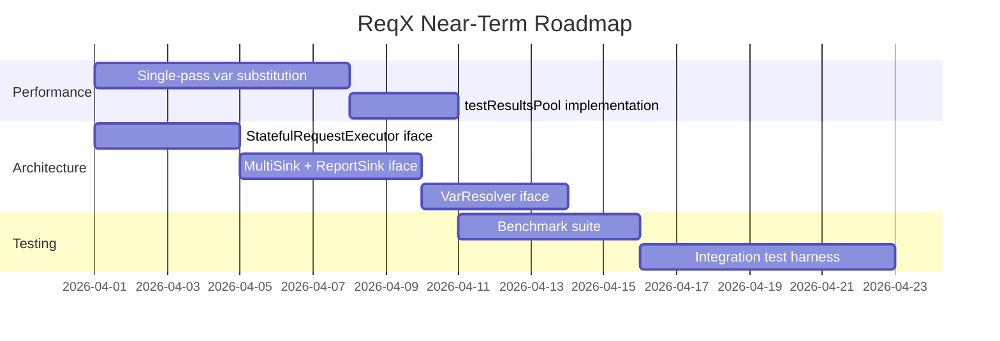

---

### Phase 2: Protocol Extensibility

The current architecture is hard-coded to three protocols (HTTP, WebSocket, Socket.IO) via `if/else` blocks in `CollectionRunner.Run`. This violates the Open/Closed Principle for protocol support.

**Proposed:** A `ProtocolHandler` registry:

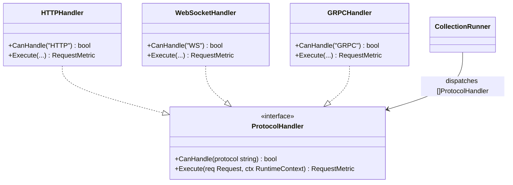

Adding gRPC, GraphQL-over-WS, or MQTT support becomes purely additive: implement `ProtocolHandler`, register it, done.

---

### Phase 3: Stage-Based Load Profiles

The `Scheduler` currently supports flat concurrency. Real load tests need ramp-up, steady-state, and ramp-down stages.

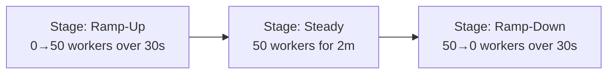

The `stage_struct.go` and `scheduler_stage_method.go` files already exist, suggesting this is partially implemented or planned. The `StageConfig` struct and stage parsing (`stage_parse_util.go`) indicate the scaffolding is present — it needs to be connected to the worker scaling logic.

---

### Phase 4: Distributed Execution

For multi-node load testing, a coordinator-agent model would extend naturally from the current architecture:

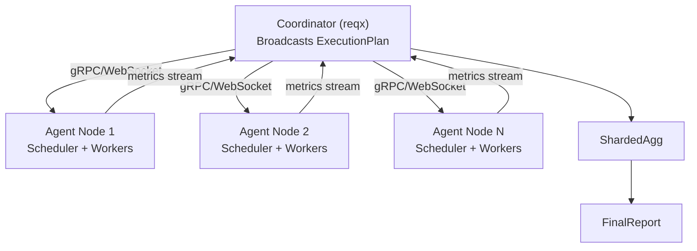

The `ExecutionPlan` is already JSON-serializable (it wraps `collection.Request` which has JSON tags), making it straightforward to transmit to agents. The `ShardedAggregator` already accepts metrics from any goroutine — extending it to accept from a network stream is a matter of adding a `ConsumeRemote(chan RequestMetric)` method.

---

### Phase 5: Plugin System via WASM or RPC

For community-contributed reporters, authenticators, or protocol handlers, a lightweight plugin boundary (e.g., HashiCorp's `go-plugin` over gRPC, or WASM modules) would allow extensions without recompilation. The `ReportSink` interface designed in Phase 1 is already plugin-ready — it only requires values that cross a serialization boundary.

---

## Conclusion

ReqX is an exceptionally well-engineered CLI tool for a relatively young codebase. It demonstrates:

- **Consistent naming discipline** (`_ctor`, `_struct`, `_method`, `_iface`) that makes navigation immediate.
- **Interface-driven design** that keeps the executor layer mockable and swappable.
- **Production-grade error handling** via the `errs` package with kinds, metadata, and stack traces.
- **Thoughtful performance engineering** — shared transport, VM pools, HDR histograms, sharded aggregation.
- **Clean data flow** — the `ExecutionPlan → RuntimeContext` split correctly separates static config from dynamic state.

The main areas for improvement are:
1. Completing the `sync.Pool` story (var substitution builder, test results slice).
2. Extracting the concrete type dependency in `NewCollectionRunner`.
3. Formalizing the reporting pipeline as a `ReportSink` interface.
4. Replacing the protocol dispatch `if/else` chain with a handler registry.

None of these are critical defects — they are architectural refinements that will pay dividends as the feature surface grows. The foundation is solid. The system is ready to scale.

---

*Document generated as part of a senior architecture review of the ReqX codebase (commit context: March 22, 2026).*